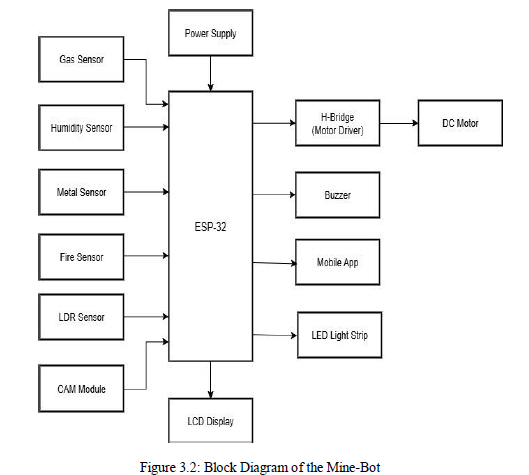
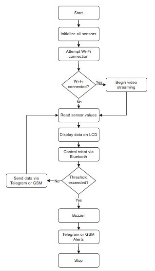
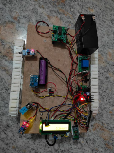
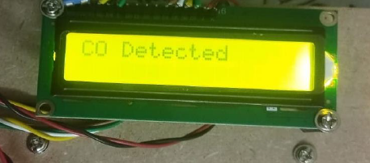
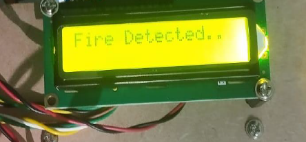
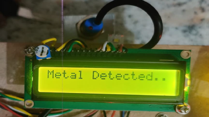
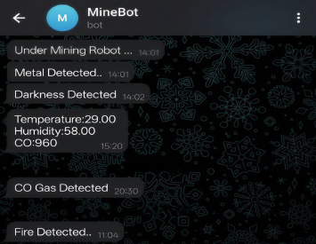
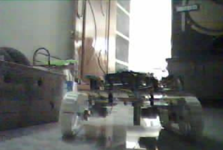

# 🤖 Mine-Bot: Robotic System for Real-Time Monitoring and Hazard Detection in Underground Mines

## 📌 Overview
Mine-Bot is an IoT-based robotic system designed to enhance safety in underground mining environments by enabling **real-time environmental monitoring, hazard detection, and remote surveillance**.

The system integrates multiple sensors with a mobile robotic platform powered by ESP32, providing live video streaming, hazard alerts, and remote control capabilities.

---

## 🎯 Problem Statement
Underground mining environments are highly hazardous due to:
- Toxic gas exposure (CO, CH₄)
- Poor ventilation and visibility
- Fire hazards and extreme temperatures

Traditional monitoring systems are:
- Manual
- Slow in response
- Limited in accuracy

👉 This project addresses the need for a **low-cost, automated, real-time monitoring system** to improve mine safety.

---

## 💡 Key Features
- 🔍 Real-time environmental monitoring (Gas, Temperature, Humidity)
- 🔥 Fire detection system
- 📡 Wi-Fi-based alert system (Telegram integration)
- 🎥 Live video streaming using ESP32-CAM
- 🤖 Bluetooth-controlled robotic navigation
- ⚠️ Instant alerts with buzzer + LCD display
- 🪨 Metal detection for underground analysis

---

## 🏗️ System Architecture

> 📍 *Insert Block Diagram image here*

The system consists of:
- ESP32 microcontroller (core processing)
- Sensors (Gas, Fire, DHT11, Metal, LDR)
- ESP32-CAM (video streaming)
- Motor driver (H-Bridge)
- Communication modules (Wi-Fi + Bluetooth)

---

## ⚙️ Hardware Components
- ESP32 Microcontroller
- ESP32-CAM Module
- MQ-Series Gas Sensor
- DHT11 Temperature & Humidity Sensor
- Fire Sensor
- Metal Sensor
- LDR Sensor
- DC Motors + H-Bridge Driver
- LCD Display
- Buzzer
- Power Supply

---

## 💻 Software & Tools
- Arduino IDE
- Embedded C
- Telegram Bot API
- Bluetooth Terminal App

---

## 🔄 Working Methodology

> 📍 *Insert Flowchart image here*

### Steps:
1. System initializes sensors and communication modules
2. Robot navigates via Bluetooth control
3. Sensors continuously monitor environmental conditions
4. ESP32 processes data in real-time
5. If threshold exceeds:
   - LCD displays warning
   - Buzzer activates
   - Telegram alert is sent
6. Live video stream enables remote monitoring

---

## 📊 Results & Outputs

### 🟢 System Prototype

> 📍 *Insert actual hardware setup image*

---

### 🚨 Gas Detection Output

> 📍 *Shows "CO Detected" alert on LCD*

---

### 🔥 Fire Detection Output

> 📍 *Shows fire alert triggered*

---

### 🪨 Metal Detection Output

> 📍 *Displays "Metal Detected"*

---

### 📱 Telegram Alert System

> 📍 *Real-time alerts sent to supervisor*

---

### 🎥 Live Video Feed

> 📍 *ESP32-CAM live streaming output*

---

## ✅ Advantages
- Enhances worker safety by reducing human exposure
- Real-time multi-sensor monitoring
- Remote control and supervision
- Low-cost and scalable solution
- Instant alert system (local + remote)

---

## ⚠️ Limitations
- Limited autonomy (manual control)
- Wi-Fi range constraints in deep mines
- Battery life limitations
- Performance affected by dust and humidity
- No cloud data storage (currently)

---

## 🌍 Applications
- Underground mine safety monitoring
- Industrial hazardous zones (oil, gas, chemical plants)
- Disaster response & rescue operations
- Tunnel and infrastructure inspection
- Remote equipment monitoring

---

## 🔮 Future Scope
- 🤖 Autonomous navigation using AI & Computer Vision
- 📡 LoRa / 5G communication for long-range connectivity
- ❤️ Wearable health monitoring for miners
- 🛠️ Industrial-grade rugged design
- ☁️ Cloud integration for data analytics

---

## 📚 References
- IEEE Research Papers on IoT-based Mine Safety Systems  
- Wireless Sensor Networks in Mining  
- Real-Time Monitoring Systems  

---

## 👨‍💻 Contributors
- Charan Mahendaran  
- M V K Rohith  
- Nithin P  
- P. Rishi Kumar  

---

## 📄 Project Report
📎 [View Full Report](./docs/report.pdf)

---

## ⭐ Show Your Support
If you found this project useful, consider giving it a ⭐ on GitHub!
